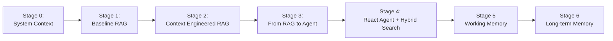

# Context Engineering with Redis & Langchain 

✨ A comprehensive course exploring context engineering using Redis and LangChain by building a progressively more complex agent ✨

## Key Technologies

| Technology | Purpose |
|------------|---------|
| **[Redis](https://redis.io/)** | Vector storage, semantic search, caching |
| **[RedisVL](https://github.com/redis/redis-vl-python)** | Vector search library with FilterQuery |
| **[LangGraph](https://github.com/langchain-ai/langgraph)** | Stateful agent workflows |
| **[LangChain](https://github.com/langchain-ai/langchain)** | LLM application framework |
| **[Redis Agent Memory Server](https://github.com/redis/agent-memory-server)** | Working and long-term memory management for agents |
| **[OpenAI](https://openai.com/)** | Language model for reasoning |

---
## Progressive Agents

The `progressive_agents/` directory contains a learning path from basic RAG to production-ready agents:

| Stage | Key Feature | Overview |
|-------|-------------|----------------|
| **Intro** | Getting Acquainted | An overview of context engineering |
| **0** | System Context | Constructing effective system prompts | 
| **1** | Baseline RAG | Exploring a basic RAG that consumes Raw JSON context |
| **2** | Data Engineering | Data engineered RAG with 50% less token usage |
| **3** | Full Agent | A full LangGraph-based agent with intent classification, quality and eval |
| **4** | Hybrid Search + ReAct | Visible reasoning trace and hybrid search |
| **5** | Working Memory | Session-based conversation history |
| **6** | Long-term Memory | Complete agent: memory + reasoning + tools |

---

