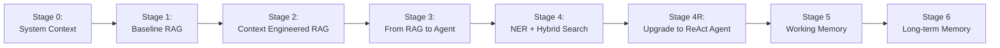

# Context Engineering with Redis & Langchain

✨ A comprehensive course exploring context engineering using Redis and LangChain by building a progressively more complex agent ✨

---

## Progressive Agents

The `progressive_agents/` directory contains a learning path from basic RAG to production-ready agents:

| Stage | Key Feature | Overview | Status |
|-------|-------------|----------------|--------|
| **0** | System Context | Constructing effective system prompts | Available |
| **1** | Baseline RAG | Exploring a basic RAG that consumes Raw JSON context | Available |
| **2** | Context Engineering | Context engineered RAG with 50% less token usage | Available |
| **3** | Full Agent | A full LangGraph-based agent with intent classification, quality and eval | Coming Soon |
| **4** | Hybrid Search | Adding NER + FilterQuery for exact course codes | Coming Soon |
| **4R** | + ReAct | Visible reasoning trace | Coming Soon |
| **5** | Working Memory | Session-based conversation history | Coming Soon |
| **6** | Long-term Memory | Complete agent: memory + reasoning + tools | Coming Soon |

---

