# Stage 5: Working Memory (Session-Based)

## 📍 Position in Learning Path

| Previous | Current | Next |
|----------|---------|------|
| [Stage 4: Hybrid Search](../stage4_hybrid_search/) | **Stage 5: Working Memory** | [Stage 6: Full Memory](../stage6_full_memory/) |

This stage adds **session-based working memory** with the **ReAct** pattern for multi-turn conversations within a session.

---

## 🎯 Purpose

This stage adds **session-based working memory**:
- **Working Memory**: Conversation history stored per session
- **ReAct Pattern**: Visible reasoning traces
- **Auto-extraction**: Facts automatically promoted to long-term storage (but no explicit tools to query it)

**Key Learning**: "Working memory enables multi-turn conversations with context continuity."

**Tools**: `search_courses` (1 tool) — Long-term memory tools are added in Stage 6.

---

## 📚 Related Notebooks

| Notebook | Concepts Applied | Implementation in This Stage |
|----------|-----------------|------------------------------|
| [Section 4: Tools and LangGraph Fundamentals](../../notebooks/section-4-tools-and-agents/01_tools_and_langgraph_fundamentals.ipynb) | ReAct pattern | `react_agent.py: ReActAgent` |
| [Section 3: Working and Long-term Memory](../../notebooks/section-3-memory-systems/01_working_and_longterm_memory.ipynb) | Working memory | `nodes.py: load/save_working_memory_node()` |
| [Section 3: Combining Memory with Retrieved Context](../../notebooks/section-3-memory-systems/02_combining_memory_with_retrieved_context.ipynb) | Memory + RAG | Agent combines history + search |

### Key Notebook Concepts Demonstrated

**From Section 4, Notebook 1 - "Tools and LangGraph Fundamentals":**
- **ReAct Pattern**: Thought → Action → Observation loop
- **Visible Reasoning**: Debug-friendly decision traces

**From Section 3, Notebook 1 - "Working and Long-term Memory":**
- **Working Memory**: Session-scoped conversation storage
- **Grounding**: Resolving "it", "that course" references

**Study Path**: Review both Stage 4 ReAct and Stage 5 Memory to understand the components, then see how they combine here.

---

## 🔄 What Changed from Stage 4

| Feature | Stage 4 | Stage 5 |
|---------|---------|---------|
| **Memory** | None | **Working memory** |
| **Multi-turn** | Single query | **Conversation continuity** |
| **Reasoning** | Visible (ReAct) | Visible (ReAct) |
| **Session** | Stateless | **Session-based** |

---

## 🏗️ Architecture

```mermaid
graph TD
    Q[Query] --> LM[Load Working Memory]
    LM --> IC[Classify Intent]
    IC -->|GREETING| HG[Handle Greeting]
    IC -->|Other| RA[ReAct Agent]

    subgraph ReAct Loop
        RA --> T1[💭 Thought: Analyze + use history]
        T1 --> A1[🔧 Action: search_courses]
        A1 --> O1[👁️ Observation: Results]
        O1 --> T2[💭 Thought: Evaluate]
        T2 --> |Need more| A1
        T2 --> |Done| F[✅ FINISH]
    end

    F --> SM[Save Working Memory]
    HG --> SM
    SM --> END[Response + Reasoning Trace]

    subgraph Memory Layer
        LM -.->|Read| AMS[(Agent Memory Server)]
        SM -.->|Write| AMS
    end
```



## 🚀 Usage

### Prerequisites

1. **Install the package** (from repository root):
   ```bash
   pip install -e .
   ```

2. **Set environment variables**:
   ```bash
   export OPENAI_API_KEY="your-openai-api-key"
   export REDIS_URL="redis://localhost:6379"
   export AGENT_MEMORY_URL="http://localhost:8088"  # Optional, defaults to this
   ```

3. **Start Agent Memory Server** (required for this stage):
   ```bash
   # Check if running
   curl http://localhost:8088/v1/health

   # Start if needed (see main README for docker-compose setup)
   docker-compose up -d agent-memory-server
   ```

### Running the Agent

From the repository root:

```bash
cd progressive_agents/stage5_working_memory

# Multi-turn with visible reasoning
python cli.py --student-id alice --session-id s1 --show-reasoning "What is CS004?"
python cli.py --student-id alice --session-id s1 --show-reasoning "Tell me more about it"

# Interactive mode
python cli.py --student-id alice
```

## 📝 Example: Multi-turn with Reasoning Trace

```
Turn 1:
User: "What is CS004?"

🧠 Reasoning Trace:
================================================================================
💭 Thought: The user is asking about a specific course. I'll use exact match.

🔧 Action: search_courses
   Input: {"query": "CS004", "intent": "GENERAL", "search_strategy": "exact_match"}
👁️  Observation: Found CS004 - Web Development...

💭 Thought: I have the course information. I can provide a complete answer.

✅ FINISH
================================================================================

Answer: CS004 is Web Development, an intermediate course covering frontend and backend...
       [Saves to working memory]

Turn 2 (same session):
User: "What are the prerequisites?"
Agent: [Loads working memory, sees CS004 context]
       "CS004 has no formal prerequisites listed..."

Turn 3 (same session):
User: "Show me the syllabus"
Agent: [Loads working memory, knows we're talking about CS004]
       "Here's the syllabus for CS004..."

Turn 4 (new session, same student):
User: "What courses did I ask about before?"
Agent: [Loads long-term memory, finds CS004 from auto-extraction]
       "You previously asked about CS004 (Web Development)..."
```

## 🔧 Implementation Details

### Memory Nodes

**1. Load Working Memory Node**
- Runs at the start of each turn
- Retrieves conversation history from Agent Memory Server
- Adds previous messages to state for context

**2. Save Working Memory Node**
- Runs at the end of each turn
- Converts LangChain messages to MemoryMessage format
- Saves to Agent Memory Server
- Triggers automatic extraction to long-term memory

### State Updates

Added fields to `AgentState`:
```python
session_id: str                    # Session identifier for continuity
student_id: str                    # User identifier
working_memory_loaded: bool        # Track if memory was loaded
conversation_history: List[Dict]   # Previous messages from working memory
```

### Workflow Changes

```python
# Memory integration
workflow.set_entry_point("load_memory")      # Start by loading memory
workflow.add_edge("load_memory", "classify_intent")
# ... existing Stage 4 nodes ...
workflow.add_edge("synthesize", "save_memory")  # End by saving memory
workflow.add_edge("save_memory", END)
```

## 📝 Additional Usage Examples

**Single query**:
```bash
python cli.py --student-id alice --session-id session_001 "What is CS004?"
```

**Interactive multi-turn conversation**:
```bash
python cli.py --student-id alice --session-id session_001
```

**Resume previous session**:
```bash
# Same session_id loads previous conversation
python cli.py --student-id alice --session-id session_001
```

## 🎓 Learning Objectives

After studying this stage, you should understand:

1. **Working Memory Pattern**
   - Session-scoped conversation storage
   - Load → Process → Save lifecycle
   - Difference from LangGraph checkpointing

2. **Memory Integration with RAG**
   - How memory complements retrieval
   - When to use memory vs. search
   - Combining conversation context with retrieved data

3. **Agent Memory Server**
   - Automatic extraction to long-term memory
   - Memory deduplication and compaction
   - Semantic search over memories

4. **Multi-turn Conversations**
   - Building context across turns
   - Handling follow-up questions
   - Session management

## 🔍 Key Differences from Reference Agent

The reference agent (`redis_context_course/agent.py`) includes:
- Long-term memory tools (search_memories, store_memory)
- LangGraph checkpointing for graph state persistence
- More complex tool orchestration

Stage 5 focuses on:
- **Working memory only** (simpler, more focused)
- No long-term memory tools (auto-extraction handles it)
- No checkpointing (not needed for this demo)
- Educational clarity over production features

## 🔍 Code References & Automatic Behaviors

This section provides exact code references for the combined ReAct + Memory implementation.

### Code References

**ReAct Pattern (from Stage 4):**

| Concept | File | Lines | Description |
|---------|------|-------|-------------|
| ReAct Agent | `progressive_agents/stage5_working_memory/agent/react_agent.py` | All | ReAct loop with memory context |
| ReAct Prompts | `progressive_agents/stage5_working_memory/agent/react_prompts.py` | All | System prompt with memory awareness |

**Working Memory:**

| Concept | File | Lines | Description |
|---------|------|-------|-------------|
| Load Memory Node | `progressive_agents/stage5_working_memory/agent/nodes.py` | `load_working_memory_node()` | Retrieves conversation history |
| Save Memory Node | `progressive_agents/stage5_working_memory/agent/nodes.py` | `save_working_memory_node()` | Persists conversation |

### Automatic Behaviors (Agent Memory Server)

| Behavior | How It Works | Configuration |
|----------|--------------|---------------|
| **Automatic Compression** | Truncation, sliding window, summarization | `WINDOW_SIZE`, `MemoryStrategyConfig` |
| **Automatic Extraction** | Extracts facts from working to long-term memory | Runs on `put_working_memory()` |
| **Memory Deduplication** | Prevents duplicate memories | Built into Agent Memory Server |

See **[Section 3, Notebook 3](../../notebooks/section-3-memory-systems/03_manage_long_conversations_with_compression_strategies.ipynb)** for detailed configuration.

---

## 🔗 Related Resources

### Learning Path Navigation
- **Previous**: [Stage 4: Hybrid Search](../stage4_hybrid_search/) - Hybrid search with ReAct (no memory)
- **Next**: [Stage 6: Full Memory](../stage6_full_memory/) - Adds long-term memory tools for cross-session personalization

### Notebooks to Study
- **[Section 3: Working and Long-term Memory](../../notebooks/section-3-memory-systems/01_working_and_longterm_memory.ipynb)**: Memory fundamentals
- **[Section 3: Managing Long Conversations](../../notebooks/section-3-memory-systems/03_manage_long_conversations_with_compression_strategies.ipynb)**: Compression strategies (automatic behaviors)
- **[Section 4: Tools and LangGraph Fundamentals](../../notebooks/section-4-tools-and-agents/01_tools_and_langgraph_fundamentals.ipynb)**: ReAct pattern

### Technical Resources
- **Reference Agent**: Production-ready implementation with full memory architecture
- **Agent Memory Server**: https://github.com/redis/agent-memory-server

