# Stage 6: Full Memory (Working + Long-term)

## 📍 Position in Learning Path

| Previous | Current | Next |
|----------|---------|------|
| [Stage 5: Working Memory](../stage5_working_memory/) | **Stage 6: Full Memory** | — (Final Stage) |

The **final stage** combining all features: **working memory**, **long-term memory tools**, and **visible ReAct reasoning**.

---

## 🎯 Purpose

This is the culmination of the progressive agents learning path. It combines:
- **Working Memory** (from Stage 5): Session-based conversation history
- **Long-term Memory Tools**: Explicit tools to store and query cross-session facts
- **ReAct Pattern** (from Stage 4): Visible reasoning

**Key Learning**: "A production-ready agent combines working memory, long-term memory tools, and transparent reasoning."

**Tools**: `search_courses`, `search_memories`, `store_memory` (3 tools)

---

## 📚 Related Notebooks

This stage demonstrates concepts from all notebook sections:

| Notebook | Concepts Applied | Implementation in This Stage |
|----------|-----------------|------------------------------|
| [Section 4: Tools and LangGraph Fundamentals](../../notebooks/section-4-tools-and-agents/01_tools_and_langgraph_fundamentals.ipynb) | ReAct pattern | `react_agent.py: ReActAgent` |
| [Section 3: Working and Long-term Memory](../../notebooks/section-3-memory-systems/01_working_and_longterm_memory.ipynb) | Both memory types | `nodes.py`, `tools.py` |
| [Section 3: Combining Memory with Retrieved Context](../../notebooks/section-3-memory-systems/02_combining_memory_with_retrieved_context.ipynb) | Memory + RAG | Agent combines all sources |
| [Section 4: Building Course Advisor Agent](../../notebooks/section-4-tools-and-agents/02_building_course_advisor_agent.ipynb) | Multi-tool agents | 3 tools with decision-making |
| [Section 2: Crafting and Optimizing Context](../../notebooks/section-2-retrieved-context-engineering/02_crafting_and_optimizing_context.ipynb) | Progressive disclosure | `HierarchicalContextAssembler` |

### Key Notebook Concepts Demonstrated

**From Section 4, Notebook 1 - "Tools and LangGraph Fundamentals":**
- **ReAct Pattern**: Thought → Action → Observation loop
- **Visible Reasoning**: Debug-friendly decision traces

**From Section 3, Notebooks 1-2 - Memory Systems:**
- **Working Memory**: Session-scoped conversation storage
- **Long-term Memory**: Cross-session preference persistence
- **Memory + RAG**: Combining all context sources

**From Section 4, Notebook 2 - "Building Course Advisor Agent":**
- **Multi-Tool Decision Making**: LLM chooses between 3 tools
- **Tool Composition**: Combining memory + search in single turn

**Study Path**: This stage integrates all previous concepts. Review earlier stages and notebooks to understand each component.

---

## 🔄 What Changed from Stage 5

| Feature | Stage 5 (Working Memory) | Stage 6 (Full Memory) |
|---------|--------------------------|----------------------|
| **Working Memory** | Yes (session-based) | Yes (session-based) |
| **Long-term Memory Tools** | No (auto-extraction only) | **Yes (`search_memories`, `store_memory`)** |
| **Tools** | 1 (`search_courses`) | **3** (`search_courses`, `search_memories`, `store_memory`) |
| **Reasoning** | Visible (ReAct) | Visible (ReAct) |
| **Personalization** | Within session only | **Cross-session** |

---

## 🏗️ Architecture

```mermaid
graph TD
    Q[Query] --> LM[Load Working Memory]
    LM --> IC[Classify Intent]
    IC -->|GREETING| HG[Handle Greeting]
    IC -->|Other| RA[ReAct Agent]

    subgraph ReAct Loop
        RA --> T1[💭 Thought: Analyze + plan]
        T1 --> A1[🔧 Action: choose tool]
        A1 --> O1[👁️ Observation: Results]
        O1 --> T2[💭 Thought: Evaluate]
        T2 --> |Need more| A1
        T2 --> |Done| F[✅ FINISH]
    end

    subgraph Available Tools
        A1 -->|search| SC[search_courses]
        A1 -->|store| RM[remember_user_info]
        A1 -->|recall| RC[recall_user_info]
    end

    F --> SM[Save Working Memory]
    HG --> SM
    SM --> END[Response + Reasoning Trace]

    subgraph Memory Layer
        LM -.->|Read| AMS[(Agent Memory Server)]
        SM -.->|Write| AMS
        RM -.->|Write| LTM[(Long-term Memory)]
        RC -.->|Read| LTM
    end
```



## 🔧 Available Tools

| Tool | Purpose | Example Trigger |
|------|---------|-----------------|
| **search_courses** | Search course catalog | "Find ML courses" |
| **remember_user_info** | Store to long-term memory | "I prefer online courses" |
| **recall_user_info** | Search long-term memory | "What did I say I liked?" |

## 🚀 Usage

### Prerequisites

1. **Install the package** (from repository root):
   ```bash
   pip install -e .
   ```

2. **Set environment variables**:
   ```bash
   export OPENAI_API_KEY="your-openai-api-key"
   export REDIS_URL="redis://localhost:6379"
   export AGENT_MEMORY_URL="http://localhost:8088"  # Optional, defaults to this
   ```

3. **Start Agent Memory Server** (required for this stage):
   ```bash
   # Check if running
   curl http://localhost:8088/v1/health

   # Start if needed (see main README for docker-compose setup)
   docker-compose up -d agent-memory-server
   ```

### Running the Agent

From the repository root:

```bash
cd progressive_agents/stage6_full_memory

# Store a preference (uses store_memory tool)
python cli.py --student-id alice --show-reasoning "I prefer online courses"

# Query using stored preference (uses search_memories + search_courses)
python cli.py --student-id alice --show-reasoning "What courses do you recommend?"

# Interactive mode
python cli.py --student-id alice
```

## 📝 Example: Full Pipeline with Reasoning

```
User: "I prefer online courses. What ML courses do you recommend?"

🧠 Reasoning Trace:
================================================================================
💭 Thought: The user expressed a preference AND asked for recommendations.
            I should store the preference first, then search for courses.

🔧 Action: remember_user_info
   Input: {"user_id": "alice", "info_type": "preference", "info": "prefers online courses"}
👁️  Observation: Successfully stored user preference.

💭 Thought: Now I should search for ML courses, filtering for online format.

🔧 Action: search_courses
   Input: {"query": "machine learning", "intent": "GENERAL", "search_strategy": "hybrid"}
👁️  Observation: Found 5 courses: CS010 (ML Fundamentals), CS011 (Deep Learning), ...

💭 Thought: I have courses and stored the preference. I can provide recommendations.

✅ FINISH
================================================================================

Answer: I've noted your preference for online courses! Here are some ML courses available online:
        1. CS010 - Machine Learning Fundamentals (Advanced, 4 credits)
        2. CS011 - Deep Learning and Neural Networks (Advanced, 4 credits)
        ...
```

## 📁 File Structure

```
stage6_full_memory/
├── cli.py                    # CLI with --show-reasoning
├── README.md                 # This file
└── agent/
    ├── __init__.py
    ├── react_agent.py        # ReAct loop implementation
    ├── react_parser.py       # Thought/Action/Observation parser
    ├── react_prompts.py      # System prompt with 3 tools
    ├── nodes.py              # Memory nodes + react_agent_node
    ├── tools.py              # search_courses, remember, recall
    ├── state.py              # WorkflowState with reasoning_trace
    ├── setup.py              # Initialization
    └── workflow.py           # LangGraph graph
```

## ⬅️ Previous Stages

- **Stage 5** (`stage5_working_memory/`): ReAct + working memory (no long-term tools)
- **Stage 4** (`stage4_hybrid_search/`): ReAct + hybrid search (no memory)
- **Stage 3** (`stage3_full_agent_without_memory/`): Basic agent with tool calling

**Important:** `--student-id` is required for this stage! This identifies the student for long-term memory storage.

### Example Conversations

#### Session 1: Store Preferences

```
User: "Hi! I'm interested in machine learning. I prefer online courses."

Agent:
1. store_memory("Student is interested in machine learning", topics=["interests", "ML"])
2. store_memory("Student prefers online course format", topics=["preferences", "format"])
3. search_courses("machine learning")

Response: "I've noted that you're interested in machine learning and prefer online courses! 
Here are some ML courses available online: [course list]"
```

#### Session 2: Personalized Recommendations (New Session)

```
User: "What courses would you recommend?"

Agent:
1. search_memories("student preferences and interests")
   → Returns: "interested in ML", "prefers online"
2. search_courses("machine learning", ...)

Response: "Based on your interest in machine learning and preference for online courses, 
I recommend: [personalized course list]"
```

---

## Testing

### Run Memory Tools Test Suite

```bash
python test_memory_tools.py
```

This tests:
- ✅ Storing student preferences
- ✅ Retrieving memories in new session
- ✅ Multi-tool decision-making
- ✅ Cross-session persistence

### Run Simple Tests

```bash
python test_simple.py
```

---

## Implementation Details

### Memory Tools

#### search_memories_tool

```python
@tool("search_memories", args_schema=SearchMemoriesInput)
async def search_memories_tool(query: str, limit: int = 5) -> str:
    """Search student's long-term memory for preferences and facts."""
```

**Parameters:**
- `query`: Natural language query (e.g., "career goals", "preferences")
- `limit`: Max number of memories to return (default: 5)

**Returns:** Formatted list of memories with topics

#### store_memory_tool

```python
@tool("store_memory", args_schema=StoreMemoryInput)
async def store_memory_tool(
    text: str, 
    memory_type: str = "semantic", 
    topics: List[str] = []
) -> str:
    """Store important information to student's long-term memory."""
```

**Parameters:**
- `text`: Information to store (e.g., "Student prefers online courses")
- `memory_type`: "semantic" (facts) or "episodic" (events)
- `topics`: Tags for organization (e.g., ["preferences", "format"])

**Returns:** Confirmation message

---

## Educational Value

### What This Stage Teaches

1. **Long-term Memory Tools**
   - How to implement memory search/store as LangChain tools
   - When to use long-term vs working memory
   - Memory types (semantic vs episodic)

2. **Multi-Tool Decision Making**
   - LLM decides between 3 tools
   - Tool selection based on query intent
   - Combining multiple tools in single turn

3. **Personalization Patterns**
   - Storing user preferences
   - Retrieving context for personalization
   - Cross-session continuity

4. **Memory Management**
   - What to store (preferences, goals, constraints)
   - What NOT to store (temporary info, course details)
   - Using topics for organization

---

## Files Modified from Stage 5

| File | Changes | Lines Added |
|------|---------|-------------|
| `agent/tools.py` | Added 2 new tools + schemas | ~160 lines |
| `agent/nodes.py` | Updated tool binding + system prompt | ~30 lines |
| `agent/workflow.py` | Updated docstring | ~2 lines |
| `cli.py` | Updated titles | ~5 lines |

**Total:** ~200 lines of code added

---

## Troubleshooting

### "Error: Student ID not set"

**Cause:** `student_id` not passed to `run_agent_async()`

**Solution:** Always provide `student_id` parameter:
```python
result = await run_agent_async(
    agent=agent,
    query=query,
    session_id=session_id,
    student_id="alice",  # Required!
    enable_caching=False,
)
```

### "No relevant memories found"

**Cause:** No memories stored yet for this student

**Solution:** First share preferences to store memories:
```
User: "I prefer online courses and I'm interested in ML"
```

### Agent Memory Server not available

**Cause:** Agent Memory Server not running

**Solution:** Start the server:
```bash
# Check if running
curl http://localhost:8088/health

# Start if needed (see Agent Memory Server docs)
```

---

## 🔍 Code References & Automatic Behaviors

This section provides a comprehensive summary of all code references and automatic behaviors across the entire progressive agents learning path.

### ReAct Loop Implementation

**Code References:**

| Concept | File | Lines | Description |
|---------|------|-------|-------------|
| ReAct Agent Node | `progressive_agents/stage6_full_memory/agent/react_agent.py` | 91-265 | `react_agent_node()` - main ReAct loop |
| Thought → Action → Observation | `progressive_agents/stage6_full_memory/agent/react_agent.py` | 153-226 | Loop iteration with parsing and execution |
| Tool Execution | `progressive_agents/stage6_full_memory/agent/react_agent.py` | 41-88 | `execute_react_tool()` - dispatches to tools |
| ReAct Prompts | `progressive_agents/stage6_full_memory/agent/react_prompts.py` | All | System prompt with ReAct format |
| Output Parser | `progressive_agents/stage6_full_memory/agent/react_parser.py` | All | Parses Thought/Action/Observation |
| Node Integration | `progressive_agents/stage6_full_memory/agent/nodes.py` | 1087-1090 | Imports and aliases `react_agent_node` |

**ReAct Loop Pattern:**

```python
# From progressive_agents/stage6_full_memory/agent/react_agent.py (lines 91-230)
async def react_agent_node(state: WorkflowState) -> WorkflowState:
    """ReAct agent node with explicit Thought → Action → Observation loop."""

    for iteration in range(max_iterations):
        # 1. Get LLM response with Thought + Action
        response = await llm.ainvoke(messages)
        parsed = parse_react_output(response.content)

        # 2. Log Thought
        if parsed["thought"]:
            reasoning_trace.append({"type": "thought", "content": parsed["thought"]})

        # 3. Check for FINISH action
        if parsed["action"].upper() == "FINISH":
            final_answer = extract_final_answer(parsed["action_input"])
            break

        # 4. Execute tool and get Observation
        tool_result = await execute_react_tool(action, action_input, student_id)
        observation = format_observation(tool_result, max_length=8000)

        # 5. Add to messages for next iteration
        messages.append(AIMessage(content=response.content))
        messages.append(HumanMessage(content=f"\n{observation}\n"))
```

### Complete Automatic Behaviors Summary

Stage 6 inherits all automatic behaviors from previous stages:

| Behavior | Source | How It Works |
|----------|--------|--------------|
| **Progressive Disclosure** | Stage 3 (`HierarchicalContextAssembler`) | Summaries for all, details for top N |
| **"Lost in the Middle" Mitigation** | Stage 3 (context structure) | Header → Summaries → Details |
| **Hybrid Search Fallback** | Stage 4 (`search_courses_sync`) | Falls back to semantic if exact match fails |
| **Automatic Compression** | Stage 5 (Agent Memory Server) | Truncation, sliding window, summarization |
| **Automatic Extraction** | Stage 5 (Agent Memory Server) | Extracts facts from working to long-term memory |
| **Memory Deduplication** | Stage 6 (Agent Memory Server) | Prevents duplicate memories |
| **Semantic Indexing** | Stage 6 (Agent Memory Server) | Creates embeddings for memory search |

### All Code References by Stage

**Stage 3 - Progressive Disclosure:**
- `src/redis_context_course/hierarchical_context.py` (lines 16-100): `HierarchicalContextAssembler`

**Stage 4 - Hybrid Search:**
- `progressive_agents/stage4_hybrid_search/agent/tools.py`: Search strategies

**Stage 5 - Working Memory:**
- `progressive_agents/stage5_working_memory/agent/nodes.py`: Load/save memory nodes

**Stage 6 - Full Memory (Working + Long-term) + ReAct:**
- `progressive_agents/stage6_full_memory/agent/tools.py`: Memory tools (`search_memories`, `store_memory`)
- `progressive_agents/stage6_full_memory/agent/react_agent.py`: ReAct implementation

### Agent Memory Server Configuration

The Agent Memory Server supports these configuration options (using defaults in progressive agents):

```python
# Available but using defaults in progressive agents
MemoryStrategyConfig(
    strategy="summary",           # Compression strategy
    max_summary_length=500,       # Max tokens for summary
    message_threshold=20,         # Summarize after N messages
    token_threshold=4000,         # Summarize after N tokens
    keep_recent=4,                # Keep N recent messages
)

# Environment variable for window size
WINDOW_SIZE=100  # Max messages in working memory
```

See **[Section 3, Notebook 3](../../notebooks/section-3-memory-systems/03_manage_long_conversations_with_compression_strategies.ipynb)** for detailed configuration examples.

---

## 🔗 Related Resources

### Learning Path Summary
This is the **final stage**. You've learned:
- **Stages 1-2**: Context engineering fundamentals
- **Stage 3**: LangGraph agent architecture + progressive disclosure
- **Stage 4**: Hybrid search with NER + ReAct visible reasoning
- **Stage 5**: Working memory + ReAct
- **Stage 6**: All features combined (long-term memory + ReAct)

### Notebooks to Review
- **[Section 1: What is Context Engineering?](../../notebooks/section-1-context-engineering-foundations/01_what_is_context_engineering.ipynb)**: Foundation concepts
- **[Section 3: Working and Long-term Memory](../../notebooks/section-3-memory-systems/01_working_and_longterm_memory.ipynb)**: Memory fundamentals
- **[Section 3: Managing Long Conversations](../../notebooks/section-3-memory-systems/03_manage_long_conversations_with_compression_strategies.ipynb)**: Automatic compression behaviors
- **[Section 4: Tools and LangGraph Fundamentals](../../notebooks/section-4-tools-and-agents/01_tools_and_langgraph_fundamentals.ipynb)**: ReAct pattern
- **[Section 4: Building Course Advisor Agent](../../notebooks/section-4-tools-and-agents/02_building_course_advisor_agent.ipynb)**: Complete agent architecture

### Technical Resources
- **Agent Memory Server**: https://github.com/redis/agent-memory-server
- **LangGraph Documentation**: https://langchain-ai.github.io/langgraph/

### What's Next?
After completing Stage 6, explore:
- **[Section 4: Semantic Tool Selection](../../notebooks/section-4-tools-and-agents/04_semantic_tool_selection.ipynb)**: Scaling to more tools (RedisVL SemanticRouter)
- **[Section 3: Managing Long Conversations](../../notebooks/section-3-memory-systems/03_manage_long_conversations_with_compression_strategies.ipynb)**: Explicit compression configuration
- **Reference Agent**: Production-ready implementation in `reference-agent/`

